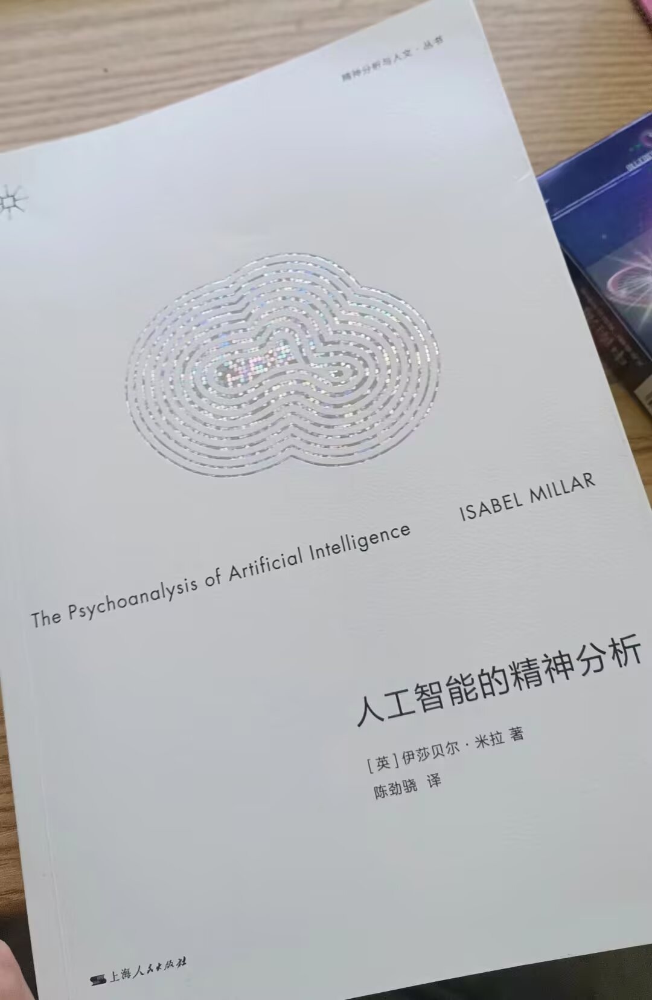

我们的享乐是否在于幻想性机器人有被当成性机器人的享乐，（注入主体性，就像我们对着ai的诗流泪一样）以一种倒错的形式完成了自渎，我们在通过艹机器-神完成享乐，而正因为是它在日常将我们视为附属的器官（也同样通过官能享乐）

我们的享乐是否在于幻想性机器人有被当成性机器人的享乐，（注入主体性，就像我们对着ai的诗流泪一样）以一种倒错的形式完成了自渎，我们在通过艹机器-神完成享乐，而正因为是它在日常将我们视为附属的器官（也同样通过官能享乐）

完成了一种幻想中的翻转，让机械变成了我们的奴隶，并且幻想它们在享受正如我们自己在享受一样（被当成奴隶的时候

**PART.2**

在男性视角的AV中，总是涉及到对女性的终极凝视，而同时却疯狂的用过量的快感去淹没她 AV中真正获得过量快感的似乎是女性，在痴迷于控制和展示女性身体和她们欲望的过程中，让男性着迷的，恰恰是女性在各种情况下所流露的某种“神秘的享乐”

所以这里男性真正享受的究竟是控制和激发女性欲望的快感（即在一个大他者的位置上享受），还是一种对于男性所不可去之处的绝望叹息？（即是自己永远无法成为一个性机器人，也清楚无法真的拥有一个“性机器人”）

所以在男优忙活一个小时，只是让女性获得一次又一次的享乐而自己累得满头大汗最终在少得可怜的高潮快感后两眼失神的绝望姿态

又一次上演了男性关于“我是否真的有阳具”/“我做到了吗？”的永恒戏剧

男性希望占据女性的享乐，或者成为女性享乐的唯一原因

所有文化中对于女性享乐的问题都有禁止和痴迷共存的扭结

**PART.3**

这本书的第四章《性的深渊》中有很多有意思的观点

例如其对施瑞伯个案（可能是拉康派最著名的精神病结构之一）的解读：

施瑞伯设想自己被原始控制论之神俘获的特殊方式——上帝以一种电缆和光纤网络的方式侵入了他

在这里，他不仅是被“推向女人的位置”/“成为了上帝的妻子”（其自己的描述），而可以更进一步的说，他成为了上帝的原始“性机器人”

这也让我们联想到了现在大量出现的关于性机器人的想象和描述，这是否正意味着施瑞伯私人妄想的公开化，也是对构建一种越来越不可能的性关系幻想的尝试？

从这个意义上来讲，也许施瑞伯的妄想正是一种对未来的憧憬，一个成为只能屈从于全能大他者享乐的性机器人。

