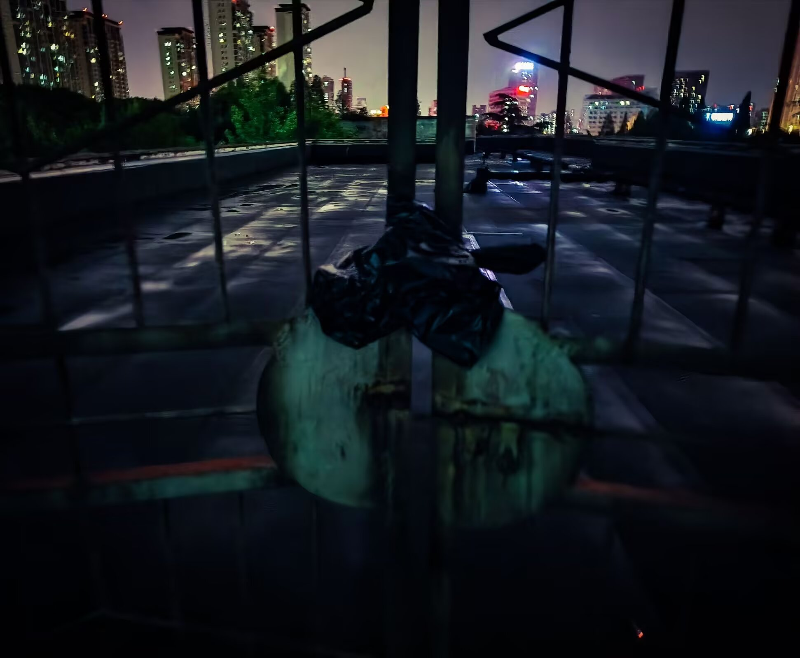

D，你身上有永远我读不透的部分，那一小部分属于黑暗和阴影的地方，那一部分从未被言说，那一部分生产着你的噩梦与幻觉，身体的悸动与颤抖，在我触摸你手腕的脉搏，能感觉到它们在你的皮肤下拥挤颤抖，饥渴于穿透，生出浓色黏稠的黑血，那些自我增殖、分形、向永恒的中心延续的幻象，我看到了黑色瘦长的雕塑，黑线、浓墨与刺刀，黑色的蛇，手术台上取出的跳动的黑色心脏.

我们在天台和街边对着星空呕吐，看深夜的车飞驰而过如迷幻的光影，你是闯入我生命的一场大火，肆意，灼热，而我们都像柴火在其中燃烧，你过去的闷痛像淤青一样晕染开，在沉默而恐怖的深夜紧握我的手，在我身边熟睡像是被荒野浸透的小兽

过去和未来之间，这些短暂的白日像悬浊的细线脆弱，易碎，无法存续，像地铁被天际线割裂，撞入宿命般的夕阳.

雨是一种断续的幕布

伞的底座像手一样将我握住

蓝调，烟雾，微醺和鲜血

谎言诉说的D

背部的线条如切割般锋利

酒精钻入身体 加热我的血液

让流质沸腾

现在世界浸没于夜与雨的火焰中

