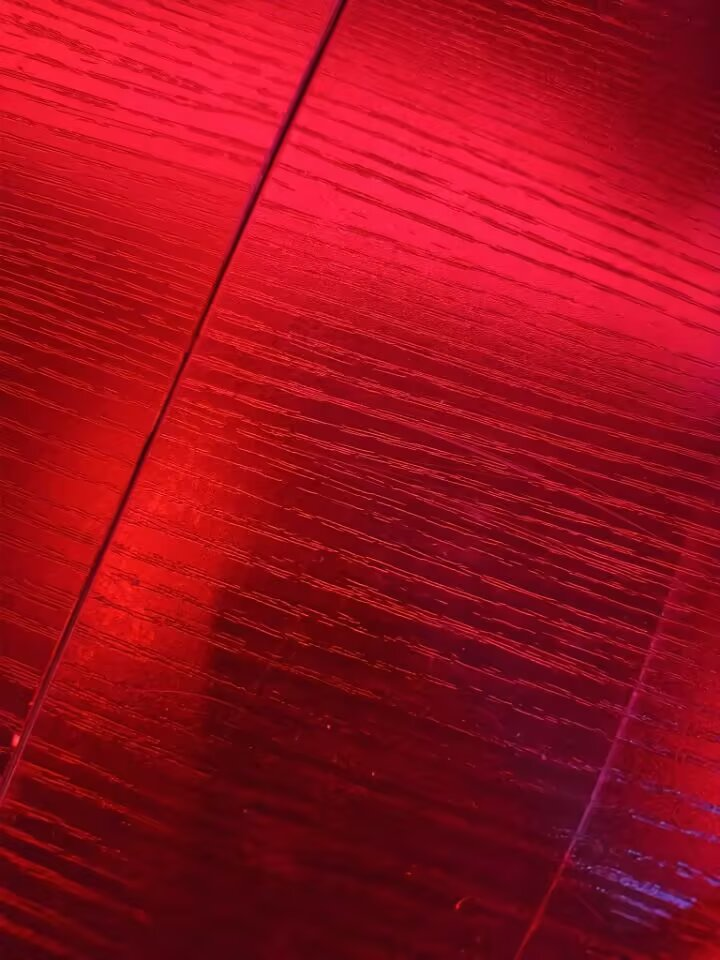

你推开窗户像推开一扇门

绿树是天然的茂密画布

我们喝酒，抽烟，迷醉

我们天南地北的聊天

让整个世界在我们的语言中翻转

词语彼此交错而又失落于空气的尾迹

像吐出的烟雾一样无迹可寻

我们都沉醉于这种单纯的乐趣

只是吐出语言，放开意识的缰绳

享受一茬又一茬语句如麦田般生成

我们伏在你危险的栏杆上给彼此拍照

熟悉的颤栗，在我靠近死亡时，如电流般涌动

我们放彼此的歌单

有些时候，歌单的历史甚至比身体还要私密

每一首歌都是一个完整的透镜，它引起场域中颤动的奇异频率

随着刻度的移动，我们像是在逐渐变小

回到一年前，两年前，五年前

像是我们迅速划过了

彼此欲望的历史

我们骑车，目睹一次车祸在咫尺之处

发生被慌乱的人群裹挟，拥挤在电动车的海潮

我们逃离于

近乎完美的光线，林荫小道

清新又腥甜的河流

溢满绿潮

