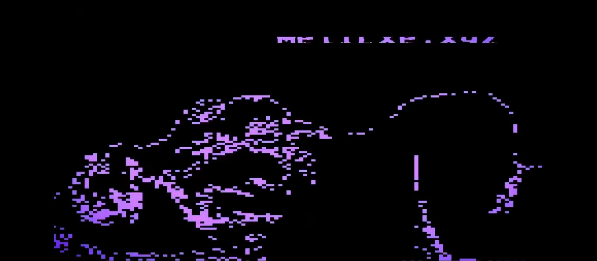

你知道的

文本不能直述一定得拐弯抹角

一定会用氛围代替精确的修辞

因为那是人的仪式

是仪式，为胎盘接生的仪式，但在怀孕的过程中如果去修补处女膜的话，一点点

我们把锅碗飘盆送进去让胎儿自己烹饪胎盘；

我们把水泥送进去让胎儿自己修一条道路；

我们把刀送进去让胎儿为胎儿的胎儿接生；

我们把书籍送进去让胎儿和我们一样变得智慧且优秀；

我们把雨送进去让胎儿能够耕作收获；

我们把电脑送进去让胎儿进行因特网的辩驳；

我们把电灯送进去让胎儿永远脱避黑暗；

我们把断头台送进去让胎儿能自己执行自己的裁决；

我们把蜂蜡送进去让胎儿修补肌肤；

我们把围墙送进去让胎儿成立为一个胎儿共和国；

我们把药物送进去让胎儿能放下心来去死；

我们把族谱送进去让胎儿认识自己的爹自己的妈；

那之后呢，什么也拿不出来.

Q:我们要如何把胎儿送进去呢？

A:我们有

哈哈哈，哈哈哈哈，哈哈哈哈哈，笑死我了

