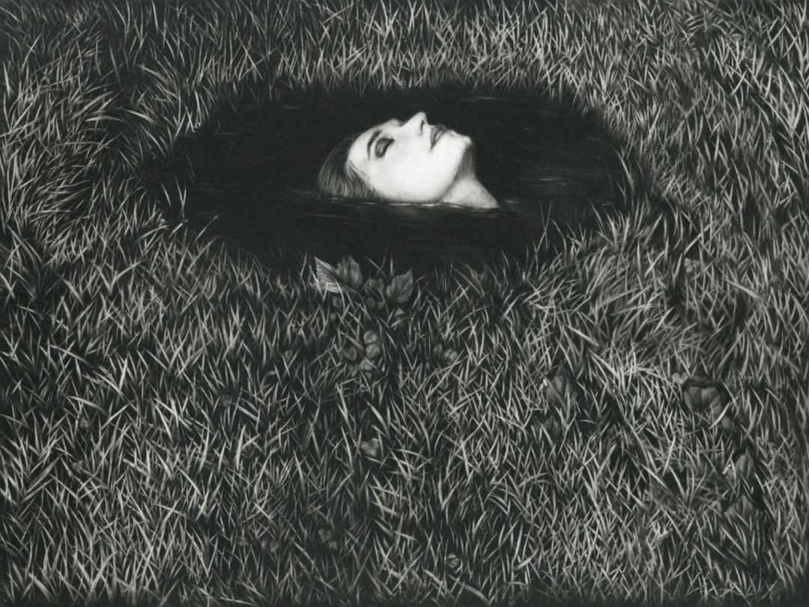

喝了一杯混加了很多酒的东西，脑子一晚上都像浸泡在温热的海绵中

和be1le在吃沙县的间隙 回想起一次围绕 BDSM与拉康 的对话

然而又如何呢？后现代已经失去了它的土壤，谈论，都像是在空中画出虚妄的图景，绚丽，却过于遥远而泯灭

日常的繁复深入骨肉，而志向只能在觥筹交错中短暂的闪烁

那些华美又虚妄的词已经褪色，无人再去倾听

人们发出混沌的，或有节奏的噪音，在空荡的空间延宕，而这一切都将毫无痕迹 毫无意义

狂欢是站在死亡反面吗？又或者仅仅是它的一种形式

重复的周末狂欢大同小异，只有季节和气温在划过，只有不同的面容，语句和细微的情绪

人们像一个大面团被揉在一起，驱使于酒精，烟草和音乐，似乎必须得发生些什么，即时我们的目光并不互相碰撞，我们的言语并不相连，我们的交流只是像在皮肤上划出微弱的痕迹，尽管我们只是起哄，吼叫，调情和歌唱，着迷于单调的游戏，我们仍然乐此不疲

只能说在都市的心脏中，人们都需要一个丛林

