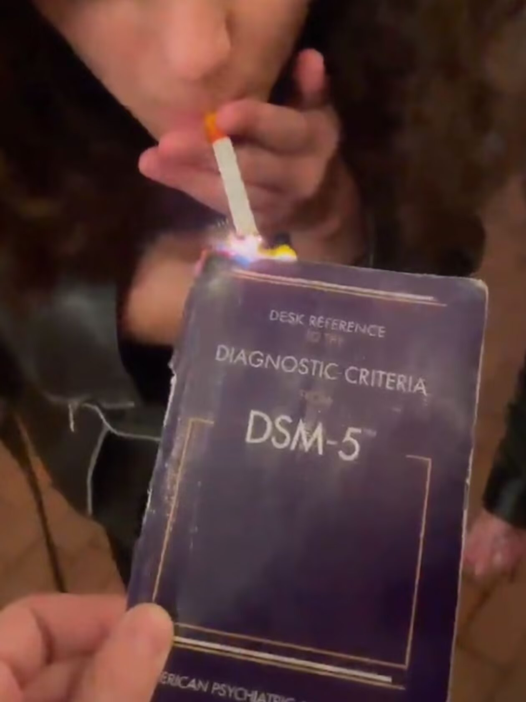

D患上了恋词癖，以下是罪己诏：

我喜欢一张照片下面有那种朴实简单的描述；“上图为一个女孩在苍茫的灰色背景下垂眸”

我喜欢一切都被翻译成语言，我所能在自身中理解的形象

我喜欢“质料，溢满，浸润，张力，场域，血肉，纽结，倒置，混沌与虚妄，收束，钝痛，白夜”

习惯于解构，习惯于迷恋词语，习惯于用语言重新咀嚼生命

总有一天我的一切都会被重新吞吐，我将把一切都描述出来，所有墙上的斑点，香烟的浓郁，树冠透光的轮廓，肌肤，酒精和情欲，那些清醒或迷狂的夜晚

我也许不能忍受我的文字被读出来，声音是一种对形的入侵，我更愿意它们被默读，在读者无意识的无色房间中震荡，回响，就像梦一样，这些文字像海潮般涨落，带起复杂，妙不可言的波纹

我不能接受它们被公开讨论，被放在阳光下照射，不，我只能接受它们和读者在阴暗的卧室单独相遇，最好是在某种绝望和狂喜的时刻，（就像齐奥朗说的，在绝望之颠或抑郁的谷底，我们终将相遇），我希望它们能够激活某种东西，希望它们能够在更深的地方和你相遇

我永远无法想象如何在公开场合介绍自己的写作，因为它们是在世界一切的表象之下，在午夜绝对的孤独和静默当中，被我经历而挖掘的，白日的世界不会有它们的位置，而或许太阳正是为了阴影而存活，又或许白日才是更长的梦境，就像我们醒来，是为了逃避梦中的大火

我们的现实难道不更像一场幻梦吗，我们都像迷魂记的主角，一直在现实中搭建自己的梦境

