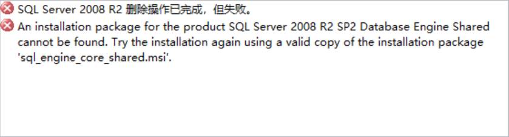

“已完成 但失败”——SQL Server

进度条走完了。

我盯着屏幕上那个弹窗,字体是微软雅黑,背景是纯白色,像是贝特曼的精致名片,措辞精确而冷漠:"已完成 但失败"。SQL Server的安装程序用了几个小时来告诉我这件事——它完成了所有它应该完成的步骤,检查了所有它应该检查的依赖,执行了所有它被编程去执行的指令。然后它宣布:失败。

这不是我第一次看到这个弹窗。五个小时前看到过,重启之后又看到,清理注册表之后还是看到。每一次,进度条都走得那么坚定,那么有条不理,仿佛这次一定会成功。每一次,最后都是同样的判决。

弗洛伊德把强迫性重复称为死亡驱力的表现。我们会不由自主地重复那些伤害我们的经验,仿佛在重复中寻找某种掌控感。我一次次地点击"重试",改变参数,调整路径,搜索解决方案。我知道下一次可能还会失败,但我无法停止。因为停止意味着承认:有些事情,不是努力就能解决的。

安装程序不会告诉我为什么失败。它只给一个错误代码。冰冷的,官僚主义的。我在无数个论坛里看到同样的代码,但没有人知道真正的原因。系统版本?权限问题?某个神秘的冲突?就像是荣格的阴影笼罩着——那些我们看不见的、被压抑的、但却决定性地影响我们的力量。

最讽刺的是那个"已完成"。安装程序确实完成了它的工作,它走完了所有流程,它尽职尽责。但完成并不意味着成功,流程的终结不等于目标的实现。活在现代社会的隐喻下:我们完成了学业,完成了大他者制定的KPI,完成了所有被期待的角色扮演,然后发现自己依然空虚。我们做对了所有的事,但我们的人生依然是那个弹窗:"已完成 但失败"。

想起那句至理名言：欲望永远是对他者欲望的欲望。我想要安装SQL Server,但我真正想要的是什么?是完成一个技术任务?还是证明自己有能力掌控机器?还是避免承认在某个环节上我无能为力?当系统一次次告诉我失败的时候,它击碎的不只是一个安装过程,而是我对自己的想象——那个无所不能的、只要努力就能解决问题的自我。

第七次重启系统的时候,天已经黑了。我看着那个熟悉的安装界面,看着进度条又开始它虚伪的旅程。我突然意识到,这个进度条本身就是一个谎言。它暗示着线性的进展,暗示着接近和抵达,但实际上它什么都不知道。它只是在演戏,给我一个控制的幻觉。

也许所有的进度条都是这样。最后我们也会看到那个弹窗:"已完成 但失败"。

我放弃了。不是放弃安装,是放弃理解为什么失败。有些症状我们永远无法完全解释,有些焦虑来自存在本身。也许有些错误代码就是这样,它们指向的不是技术问题,而是某种更根本的不可知。

我关掉电脑。屏幕暗下去的那一刻,我在漆黑的反光里看见自己的脸。火石磨平砂轮,疲惫,困惑,但奇怪地平静。我完成了我能做的一切,我失败了。这个悖论不再折磨我,它只是一个事实。

也许我会用虚拟机,或者干脆换一个版本。但今晚,我和那个弹窗和解了。"已完成 但失败"——这不是系统的bug,这是存在的真相。在运行一个不完美的程序,在一个不完全兼容的环境里,带着不充分的权限,去安装一个也许根本就装不上的东西。

为了什么？

现在是11月12日4:30,我像服务端一样码字,记录错误日志。

life_finished_failed.log

